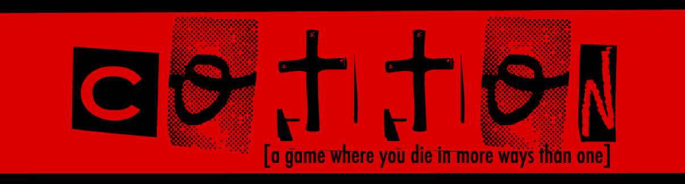

I've wanted to  get into riding motorcycles for a while now, so I did. The "common wisdom" that circulated the internet was to start small for a beginner, so I did. But I inevitably asked myself, just because you have a small bike doesn't mean it can't be a cool bike, does it?

Source: <a href="https://github.com/jogarces/ics-313-text-game"><i class="large github icon "></i>jogarces/ics-313-text-game</a>
