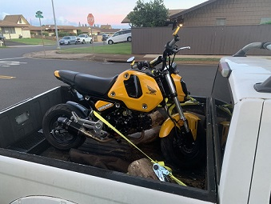
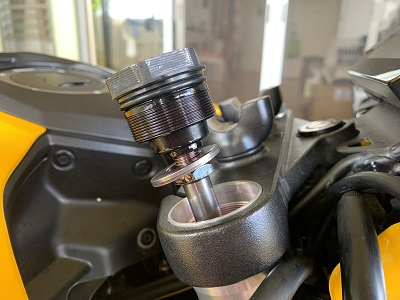
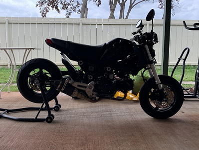
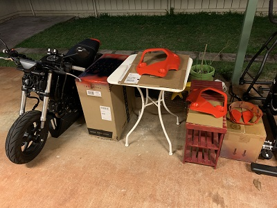
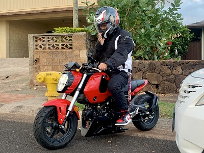
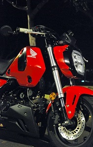

I've wanted to  get into riding motorcycles for a while now, so I did. Common sense told me to start small for a beginner, so I did. But I inevitably thought to myself, just because I have a small bike doesn't mean it can't be a cool bike too, right?

This project was definitely more of a creative one, taking into consideration inspiration from the internet and my own personal imagination. Late September of 2022, I took the plunge and bought my first "motorcycle" (it was a mini-bike). A 2022 Honda Grom. It was small and light, economical and comfortable, and cheap and accessible; the perfect learner bike.

## Delivery Day

It started off very yellow, and that needed to change. But first, my plans also included lowering both front rear end of the bike a few inches, extending the swingarm and rear wheel out a little, and changing the handle-bars for a more aesthetic setup.

My next step was to paint the plastics from yellow to red. I've never painted anything before, so this was definitely a learning experience!

Now that its red, its time to add the finishing touches. A few extra plastic body panels were installed to tie everything together, and a little fender over the rear wheel to prevent water from splashing up... and she's done! 

## Final Build

This project allowed me to experience the process of bringing something from imagination to life! There were a many firsts in this process; I've never worked on a motorcycle before, I've never painted bodywork before, and most importantly I've never ridden before... until now. 

This process has been very rewarding because of all the new experiences, not only from physically working on the bike but from all of the connections with other people I've made through riding in general. If there was one thing I'd do differently, it would have been to start this project earlier!
